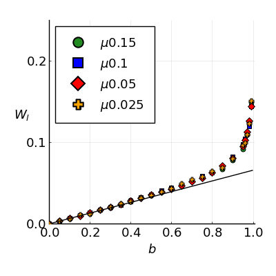
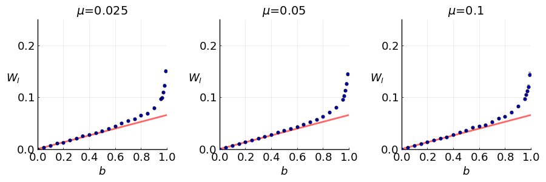
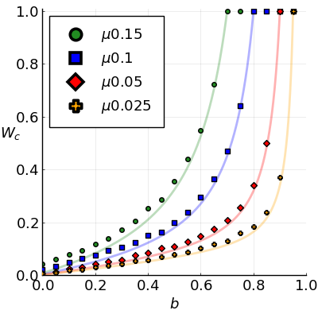
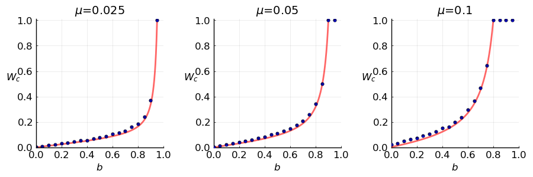
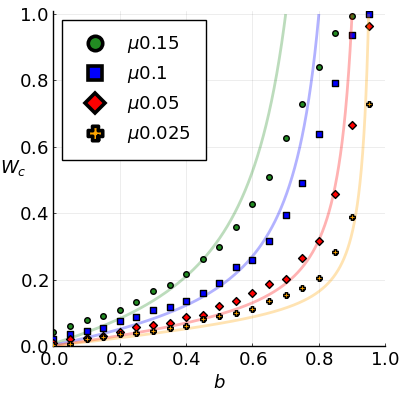
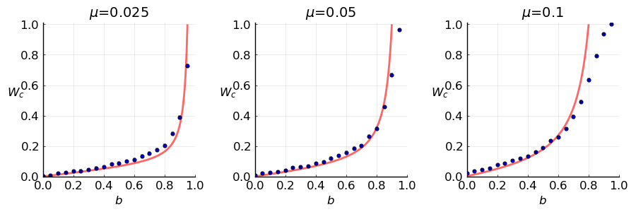

# Turnover
## Theory

> #### lineage turnover
> A mutant offspring lineage or clone is **orphaned** if it did not go extinct itselft  
> while its parental lineage (excluding the offspring lineage) went extinct.  
> W(q, N) = q / (2 log(N)) * (1-N^(-2))

> #### clone turnover
> A mutant offspring lineage or clone is **estranged** if it did not go extinct itself  
> while its parental clone went extinct.  
> W(b; a, μ, T) = μ (b + μ^2) / (1-μ)^2 / (a(1-μ/2)-b) (1-exp(-2*(a-b-aμ)T)) / (1-exp(-2aμT))

## Simulation

We simulated the exponential growth of mutant `clones` within a population of tumor cells with a Gillespie algorithm of cell division and death. A cell divides with a probability proportional to the birth rate `a` or dies with rate `b`. At birth any of the two cells can mutate with probability `μ` thus founding a new clone.

To measure the turnover from simulations a tumor population is first grown to a threshold size `N` or time `T`. The tumor then grows to a size that is sufficiently high for the parental lineages / clones to go extinct. In the case of lineage turnover the mutation rate can be set to zero for this growth phase.
The fraction of orphaned / estranged lineages that appeared up to the threshold gives the turnover. The results are averaged over a few hundred (between 200 and 1200) simulated tumors depending on mutation rate and threshold size.

For the clone turnover we additionally measured the expected fraction of estranged lineages. During simulation at birth of a mutation the current size `n` of its parental clone is recorded from which the probability of becoming estranged is computed as `q^n`, where `q` is the extinction probability for clones. Setting a time threshold instead of size slightly improves the fit to the analytical curve as expected. In this case no second growth phase is needed.

Determining whether a mutant lineage is orphaned or estranged is straight forward with knowledge of the complete genealogical tree of a all mutations. If the order of occurrence is unknown this is not possible in the case of subsequent mutations that become clonal to a lineage. Nevertheless the fraction of orphaned / estranged lineages and thus the turnover can still be computed exactly with an appropriate algorithm.

We also considered the number of mutations arising at division to be distributed as `~ Poisson(μ)`. If mutations are said to be single nucleotide variations (SNVs), this is a more realistic model. However, the results do not differ considerably at small mutation rates. The deviation in both lineage- and clone turnover from Poisson distributed mutation numbers is highest at death rate *d=0* and decays for increasing *d*.

## Results

  
**Lineage turnover** - Fractions of orphaned lineages from simulations (blue markers) plotted together with the analytical turnover curve (red line) for different mutation rates. Lineage turnover is independent from mutation rates and the measured curves coincide. Simulations were run with 200 to 800 repetitions, birth rate *a=1.*, a threshold of 2000 cells and final size of 6000. Error bars indicate standard deviation.

  
**Expected clone turnover** - Expected fraction of estranged lineages / clones from simulations (blue markers) plotted together with the analytical turnover curve (red line) for different mutation rates. A lineage's / clone's expected probability of becoming estranged to the parental clone is computed as `q^n`, with `q` being the clone extinction probability and `n` parental clone size at birth. Simulations were run with 200 to 500 repetitions, birth rate *a=1.* and time thresholds corresponding to a threshold size of 200 cells i.e. *T=log(200)/(a-b)*. Error bars indicate standard deviation.

  
**Measured clone turnover** - Fractions of estranged lineages / clones from simulations (blue markers) plotted together with the analytical turnover curve (red line) for different mutation rates. Simulations were run with 400 to 1200 repetitions, birth rate *a=1.*, a threshold of 200 cells and final size of 2000. Error bars indicate standard deviation.