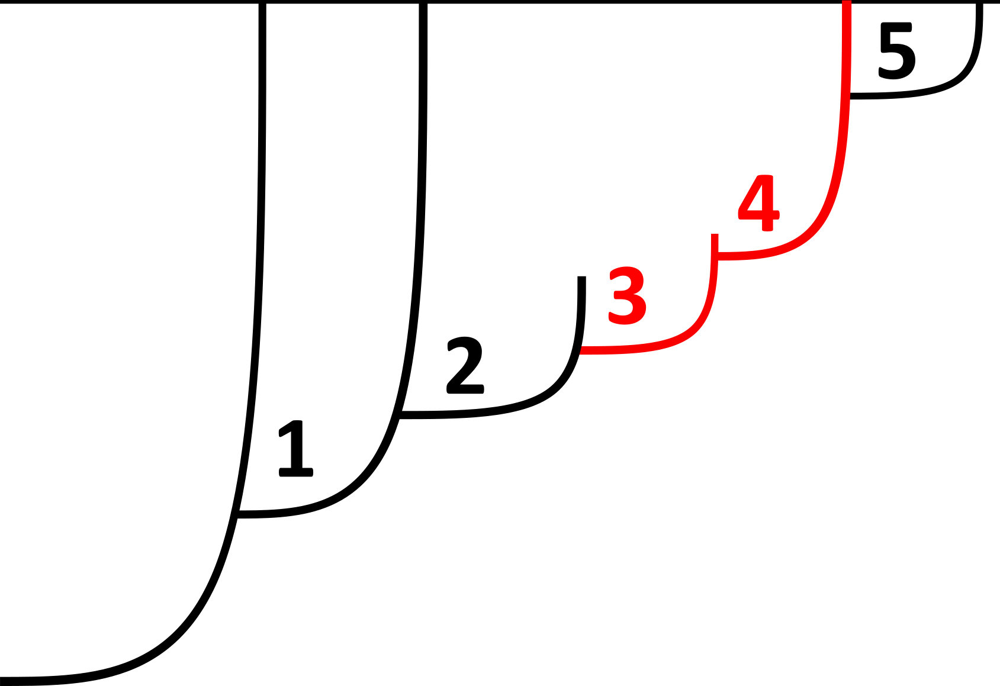

# Turnover

> *Possible inconsistencies:*
> - *haplotype - clone*
> - *clone - lineage*
> - *b - a (birth rate)*
> - *d - b (death rate)*
> - *μ - 2μ (mutation rate per cell division)*

## Theory

> #### lineage turnover
> A mutant offspring lineage or clone is **orphaned** if it did not go extinct itselft  
> while its parental lineage (excluding the offspring lineage) went extinct.  
> W(q, N) = q / (2 log(N)) * (1-N^(-2))

> #### clone turnover
> A mutant offspring lineage or clone is **estranged** if it did not go extinct itself  
> while its parental clone went extinct.  
> W(b; a, μ, T) = μ (b + μ^2) / (1-μ)^2 / (a(1-μ/2)-b) (1-exp(-2*(a-b-aμ)T)) / (1-exp(-2aμT))

## Simulation

We simulated the exponential growth of mutant `clones` within a population of tumor cells with a Gillespie algorithm of cell division and death. A cell divides with a probability proportional to the birth rate `a` or dies with rate `b`. At birth any of the two cells can mutate with probability `μ` thus founding a new clone.

To measure the turnover from simulations a tumor population is first grown to a threshold size `N` or time `T`. The tumor then grows to a size that is sufficiently high for the parental lineages / clones to go extinct. In the case of lineage turnover the mutation rate can be set to zero for this growth phase.
The fraction of orphaned / estranged lineages that appeared up to the threshold gives the turnover. The results are averaged over a few hundred (between 200 and 1200) simulated tumors depending on mutation rate and threshold size.

For the clone turnover we additionally measured the expected fraction of estranged lineages. During simulation at birth of a mutation the current size `n` of its parental clone is recorded from which the probability of becoming estranged is computed as `q^n`, where `q` is the extinction probability for clones. Setting a time threshold instead of size slightly improves the fit to the analytical curve as expected. In this case no second growth phase is needed.

Determining whether a mutant lineage is orphaned or estranged is straight forward with knowledge of the complete genealogical tree of a all mutations. If the order of occurrence is unknown this is not possible in the case of subsequent mutations that become clonal to a lineage. Nevertheless the fraction of orphaned / estranged lineages and thus the turnover can still be computed exactly with an appropriate algorithm.

We also considered the number of mutations arising at division to be distributed as `~ Poisson(μ)`. If mutations are said to be single nucleotide variations (SNVs), this is a more realistic model. However, the results do not differ considerably at small mutation rates. The deviation in both lineage- and clone turnover from Poisson distributed mutation numbers is highest at death rate *d=0* and decays for increasing *d*.

## Treeless turnover

Both the clone and the lineage turnover parameter have straightforward interpretations. The clone turnover gives the fraction of genotypes whose parental genotype is no longer extant. The lineage turnover gives (averaged over the different lineages) the fraction of lineages that coincide with their ancestral lineage.

  
**Treeless turnover** - An exemplary genealogical tree illustrating the idea behind the `treeless turnover` algorithm. Mutations `3, 4` (in red) have the same surviving lineage with the same truncal mutations `{1,2,3,4,5}` where `{1,2}` are not private but have their own distinct surviving clones. Even without knowing the order of occurence we find that one out of {3,4}` is estranged (`5`) and three are orphaned (`3` wrt. `2` and `4` wrt. `3` and `2`).

These observables are best illustrated with an example. We consider a population in which mutations `1, 2, 3, 4, 5` arose in that order (the order is given only to illustrate the example). In this population, clones carrying mutations `{}`, `{1}`, `{1, 2, 3, 4}`, `{1, 2, 3, 4, 5}` survived. Clone `{1}` has an extant parental genotype, namely `{}`. None of the extant genotypes carry exactly three mutations out of `{1, 2, 3, 4}`. The parental clone of this genotype thus became extinct. Finally genotype `{1, 2, 3, 4, 5}` has an extant parent in `{1, 2, 3, 4}`. Hence two out of three clones have extant parents, resulting in a clone turnover of `Wc = 2/3`. In order to compute the lineage turnover we go over all mutations `1, 2, 3, 4, 5`, which each define a lineage. The only ancestral lineage of mutant `1` is the original lineage which gave birth to all lineages. The clone `{}` survived, therefore lineage `1` does not coincide with its ancestor. Mutation `1` hence contributes one to the denominator and zero to the numerator of the lineage turnover. Mutation `2` does not coincide with either of its two ancestral lineages (origin and `1`) and thus adds two to the denominator and zero to the numerator. Mutation `3` is again not clonal on the original lineage and `1`, but it coincides with `2`. Its contribution to the lineage turnover is three in the denominator and one in  the numerator. The same goes for the lineage of `4`, which in addition coincides with `3`, resulting in a contribution of four to the denominator and two to the numerator. Lastly, lineage `5` has the original lineage and mutants `1, 2, 3, 4` as ancestoral lineages and coincides with neither of them, adding five to the denominator and zero to the numerator. The lineage turnover is hence `W_l = 3/15 = 1/5`.

This direct procedure assumes that we know the order in which the mutations occured, but in fact the lineage turnover can be computed without knowledge of the phylogenetic tree. For a given mutant lineage m we first identify the clonal set of mutations (also called the **trunk**; mutations which always co-occur with m) and the so-called **private subset** of truncal mutations; those truncal mutations which are unique to that lineage. The ancestors are all represented in the trunk, but m can only be clonal on ancestors which are part of its private subset. We do not know the order in which the mutations in the private subset arose, but we can compute a combined contribution to the lineage turnover. Unique trunks contribute `r(r−1)/2+r(t−r+1)` and `r(r−1)/2` to the denominator and the numerator of the lineage turnover respectively, where `r` is the size of the private subset and `t` the size of the trunk.

In the given example, mutations `2, 3, 4` have a common trunk `{1, 2, 3, 4}` of size t = 4 with r = 3 private truncal mutations `{2, 3, 4}`. They together add nine to the denominator and three to the numerator. Mutant `1` has `r = t = 1` and thus contributes zero to the numerator and one to the denominator, mutant 5 has `t = 5` and `r = 1`, contributing zero to the numerator and 5 to the denominator, yielding the same lineage turnover as above.

## Results

  
**Lineage turnover** - Fractions of orphaned lineages from simulations (blue markers) plotted together with the analytical turnover curve (red line) for different mutation rates. Lineage turnover is independent from mutation rates and the measured curves coincide. Simulations were run with 200 to 800 repetitions, birth rate *a=1.*, a threshold of 2000 cells and final size of 6000. Error bars indicate standard deviation.

  
**Expected clone turnover** - Expected fraction of estranged lineages / clones from simulations (blue markers) plotted together with the analytical turnover curve (red line) for different mutation rates. A lineage's / clone's expected probability of becoming estranged to the parental clone is computed as `q^n`, with `q` being the clone extinction probability and `n` parental clone size at birth. Simulations were run with 200 to 500 repetitions, birth rate *a=1.* and time thresholds corresponding to a threshold size of 200 cells i.e. *T=log(200)/(a-b)*. Error bars indicate standard deviation.

  
**Measured clone turnover** - Fractions of estranged lineages / clones from simulations (blue markers) plotted together with the analytical turnover curve (red line) for different mutation rates. Simulations were run with 400 to 1200 repetitions, birth rate *a=1.*, a threshold of 200 cells and final size of 2000. Error bars indicate standard deviation.

## Inference
Using the analytical results we can infer both death rate `b` and mutation rate `μ` for a given tumor and set frequency threshold `N`. Measuring its `lineage turnover` gives us an estimate of the lineage extinction probability.  
`q = b/a = 2log(N)(1-N^(-2))^-1*W_l ≈ 2log(N)*W_l`

As observed for simulations measured lineage turnover deviates from the theoretical result for high death rates `b` and low threshold size `N`. In cases where the estimated lineage extinction probability `q` does not fall below one the mutation rate cannot be inferred. However, using the results from simulations for the lineage turnover might allow a better estimation of `q`.

Using the inferred value of `b` there are two ways of obtaining the mutation rate `μ` by the clone turnover. The first and straight forward way is to determine the value of `μ` at which the theoretical clone turnover curve for given `b` assumes the measured turnover. Here the threshold time is to be estimated by `T=log(N)/(a-b)`. The other option is to (uniformly) subsample the set of sequenced mutations or consider smaller parts of the genome and thus effectively reduce the mutation rate. A mutation is selected with probability `L`, for each value of `L` the tumor can be sampled several times and the mean clone turnover computed. One obtains a pseudo clone turnover curve which can be fitted against the analytical result. Although the sets of mutations all share the same background and the curve keeps the tumors deviation from the expected clone turnover the fit generally results in a better match.  

Note: With the estimated lineage extinction probability `q` the (scaled) mutation rate `μ` can also be determined from the cumulative distribution of inverse frequencies (sottoriva plot). For an exponentially growing tumor under neutral evolution this curve is linear and the slope is given by `μ/(1-q)`.

**Turnover on spatially resolved data.** Finally, we further evaluated the turnover on spatial simulations in the bulk limit for single cell data as well as sampled data. Tumors were grown to size `10⁴`, sampled at a depth of `270` samples and filtered for mutations whose frequencies fall above the theshold `f_thresh = 1/400`. Similar to the directional parameter on samples we additionally set a lower limit of `f_sample = 1/3` on mutation frequency per sample so that a minority of cells cannot add to the sample haplotype. Note that in the case of clone turnover the lower bound on whole-tumor frequency is applied differently. Here a clone is removed from the pool if it contains a supposedly new mutation. It was found that lowering the number of samples as well as increasing the threshold does not significantly affect the quality of inference, however, results strongly depend on the sample frequency cutoff `f_sample`.
For low mutation rates `μ` and most of the range of death rates `b`, the inference results from sampled data compare well to the true underlying parameters `b/a` and `μ`, but with a higher standard deviation than observed for the single cell data results. At low relative death rate (see `b/a = 0.2`) the prediction of `b/a` is poor. The figure below also shows the inferred scaled mutation rate `μ/(1-b/a)` which fits particularly well for high rates of cell death. The methods of solving for and fitting `μ` from the clone turnover differed negligibly.
In some instances the measured clade turnover is higher than the theoretical value `W_a(q=1)` and parameters cannot be inferred. As seen for the non-spatial simulations this can also occur at high death rates due to the finite threshold size. A potential improvement to the inference approach would be to compare the turnover measured on spatial simulations to the curves from non-spatial simulations instead of the theory.

   
**Inference - `b` dependence** - Inference of death `b` and mutation rate `μ` for single tumors at fixed `μ`. Mutation rate is inferred using the estimated `b` by computing the tumors clone turnover `W_c` and comparing to the theoretical curve. For each death rate we simulate 10 tumors at `a = 1.0`, `μ = 0.2`, threshold size `N = 2000` and final size 100000. However, at `b = 0.7` two and at `b = 0.8` four of these show high lineage turnover such that `b` cannot be estimated and are excluded. Error bars indicate standard deviation.

   
**Inference with fit- `b` dependence** - Inference of death `b` and mutation rate `μ` for single tumors at fixed `μ`. Mutation rate is inferred using the estimated `b` by subsampling mutations thus effectively reducing the mutation rate, computing the clone turnover for each subset and fitting the resulting pseudo-turnover curve to the analytical curve. For each death rate we simulate 10 tumors at `a = 1.0`, `μ = 0.2`, threshold size `N = 2000` and final size 100000.  However, at `b = 0.7` two and at `b = 0.8` four of these show high lineage turnover such that `b` cannot be estimated and are excluded. The set of mutations is subsampled at probabilities `L = 0.1, 0.2..., 1.0` with 10 repetitions each. Error bars indicate standard deviation.

   
**Inference - `μ` dependence** - Inference of death `b` and mutation rate `μ` for single tumors at fixed `b`. Mutation rate is inferred using the estimated `b` by computing the tumor's clone turnover `W_c` and comparing to the theoretical curve. For each death rate we simulate 10 tumors at `a = 1.0`, `b = 0.4`, threshold size `N = 2000` and final size 100000. Error bars indicate standard deviation.

   
**Inference with fit- `μ` dependence** - Inference of death `b` and mutation rate `μ` for single tumors at fixed `b`. Mutation rate is inferred using the estimated `b` by subsampling mutations thus effectively reducing the mutation rate, computing the clone turnover for each subset and fitting the resulting pseudo-turnover curve to the analytical curve. For each death rate we simulate 10 tumors at `a = 1.0`, `b = 0.4`, threshold size `N = 2000` and final size 100000. The set of mutations is subsampled at probabilities `L = 0.1, 0.2..., 1.0` with 10 repetitions each. Error bars indicate standard deviation.

   
**Parameter inference on sampled spatial data** - The figure shows inferred death rates `b_inf` and mutation rates `μ_inf` for spatial simulations of exponential growth. The third plot from the left additionally shows the inferred scaled mutation rate `μ/(1-b/a)`. Blue markers represent single simulations, the bars show mean and standard deviation for each death rate `b` and the red line indicates a perfect match to the underlying paremeters.
Populations are grown to size `10⁴` at different death rates `b`, fixed mutation rate `μ = 0.2` and birth rate `a=1.`. The tumor plane is sampled evenly at a sampling depth of `270` (similar to Ling et al.). Frequency threshold and sample frequency cutoff (see text) are set to `f_thresh = 1/400` and `f_sample = 1/3` respectively.
