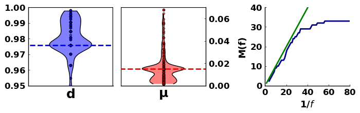
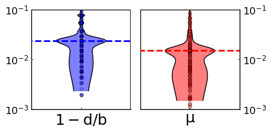
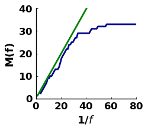

# Settings for turnover based inference 

## data
 - data: Ling Sanger genotyped samples
 - clone clustering: simple coincidence clustering

## settings
 - mutation must occur in at least: 2 samples
 - population size estimate N: 2062 cells
 - mutation subsamling range L: 0.5:0.1:1.0
 - repeats per L: 50
 - drop nonunique: false

## results
 - d/b: 0.976
 - mu*L: 0.015
 - mu: 1.18e-8

